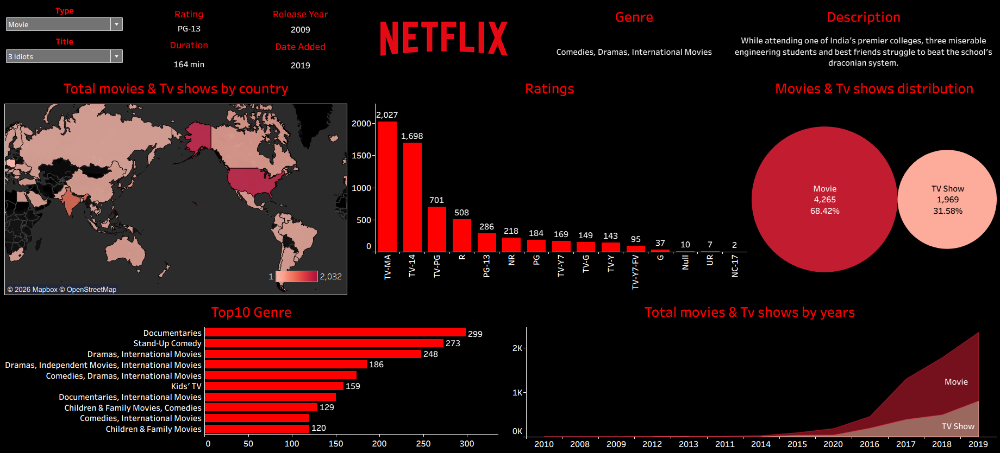

# Netflix Tableau Dashboard

## 📊 Project Overview
This project analyzes Netflix dataset using Tableau and presents key insights through an interactive dashboard.

## 🔍 Key Insights
- Content distribution by type (Movies vs TV Shows)
- Country-wise content analysis
- Genre distribution
- Release year trends

## 🛠 Tools Used
- Tableau
- Netflix Dataset

## 📁 File Included
- netflix-tableau-dashboard.twbx

## 📸 Dashboard Preview

